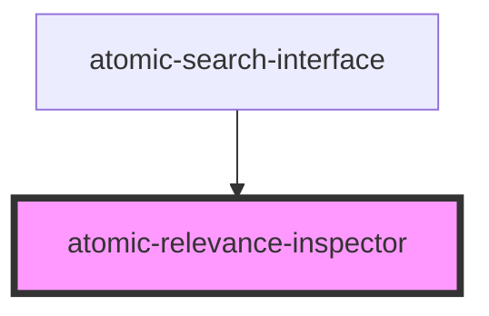

# atomic-relevance-inspector

<!-- Auto Generated Below -->

## Properties

| Property              | Attribute | Description | Type                     | Default     |
| --------------------- | --------- | ----------- | ------------------------ | ----------- |
| `engine` _(required)_ | --        |             | `Engine<SearchAppState>` | `undefined` |

## Dependencies

### Used by

 - [atomic-search-interface](../atomic-search-interface)

### Graph

----------------------------------------------

*Built with [StencilJS](https://stenciljs.com/)*
