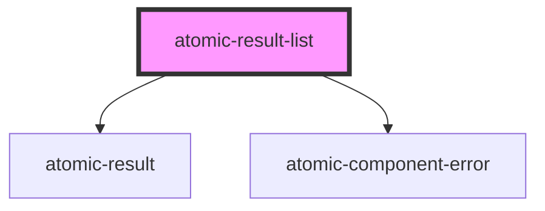

# atomic-result-list

<!-- Auto Generated Below -->

## Properties

| Property           | Attribute            | Description                    | Type     | Default |
| ------------------ | -------------------- | ------------------------------ | -------- | ------- |
| `listClass`        | `list-class`         | Css class for the list wrapper | `string` | `''`    |
| `listElementClass` | `list-element-class` | Css class for a list element   | `string` | `''`    |

## Shadow Parts

| Part             | Description      |
| ---------------- | ---------------- |
| `"list"`         | The list wrapper |
| `"list-element"` | The list element |

## Dependencies

### Depends on

- [atomic-result](../atomic-result)
- [atomic-component-error](../atomic-component-error)

### Graph

----------------------------------------------

*Built with [StencilJS](https://stenciljs.com/)*
