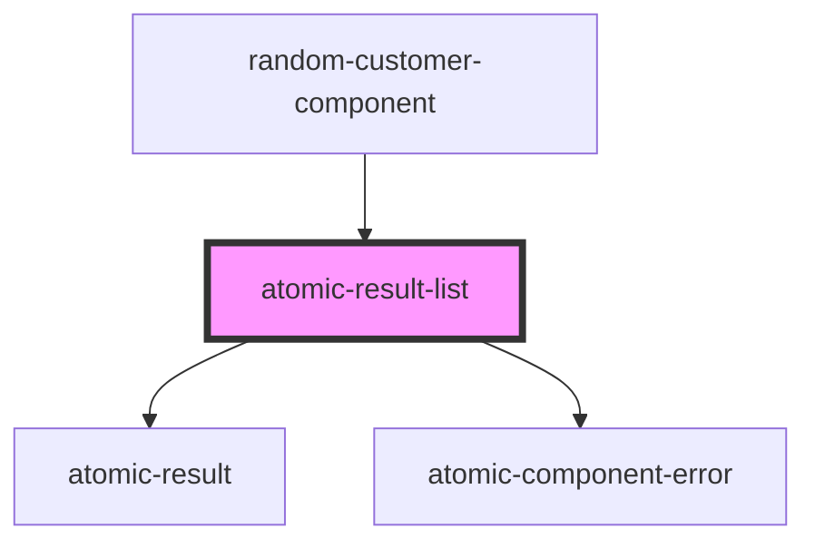

# atomic-result-list

<!-- Auto Generated Below -->

## Properties

| Property               | Attribute                | Description                                                                                                                                              | Type                                  | Default     |
| ---------------------- | ------------------------ | -------------------------------------------------------------------------------------------------------------------------------------------------------- | ------------------------------------- | ----------- |
| `enableInfiniteScroll` | `enable-infinite-scroll` | Whether to automatically retrieve an additional page of results and append it to the current results when the user scrolls down to the bottom of element | `boolean`                             | `false`     |
| `engine`               | --                       |                                                                                                                                                          | `Engine<SearchAppState> \| undefined` | `undefined` |
| `fieldsToInclude`      | `fields-to-include`      |                                                                                                                                                          | `string`                              | `''`        |
| `listClass`            | `list-class`             | Css class for the list wrapper                                                                                                                           | `string`                              | `''`        |
| `listElementClass`     | `list-element-class`     | Css class for a list element                                                                                                                             | `string`                              | `''`        |

## Shadow Parts

| Part             | Description      |
| ---------------- | ---------------- |
| `"list"`         | The list wrapper |
| `"list-element"` | The list element |

## Dependencies

### Used by

 - [random-customer-component](../random-customer-component)

### Depends on

- [atomic-result](../atomic-result)
- [atomic-component-error](../atomic-component-error)

### Graph

----------------------------------------------

*Built with [StencilJS](https://stenciljs.com/)*
