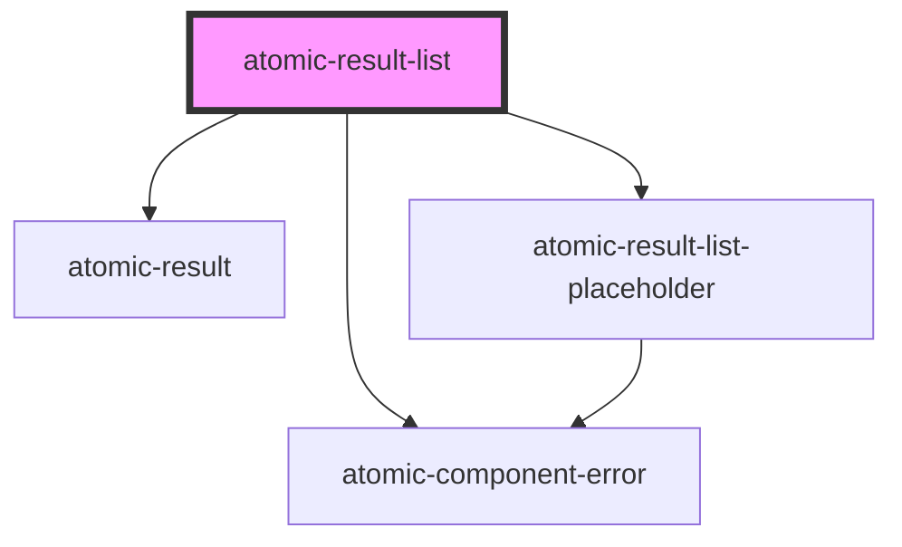

# atomic-result-list

<!-- Auto Generated Below -->

## Properties

| Property          | Attribute           | Description                                                            | Type     | Default |
| ----------------- | ------------------- | ---------------------------------------------------------------------- | -------- | ------- |
| `fieldsToInclude` | `fields-to-include` | A list of fields to include in the query results, separated by commas. | `string` | `''`    |

## Dependencies

### Depends on

- [atomic-result](../atomic-result)
- [atomic-result-list-placeholder](../atomic-result-list-placeholder)
- [atomic-component-error](../atomic-component-error)

### Graph

---

_Built with [StencilJS](https://stenciljs.com/)_
