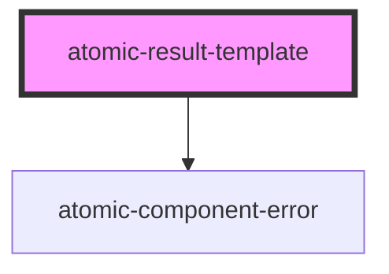

# atomic-result-template

<!-- Auto Generated Below -->

## Properties

| Property     | Attribute | Description | Type                        | Default |
| ------------ | --------- | ----------- | --------------------------- | ------- |
| `conditions` | --        |             | `ResultTemplateCondition[]` | `[]`    |

## Methods

### `getTemplate() => Promise<ResultTemplate<string> | null>`

#### Returns

Type: `Promise<ResultTemplate<string> | null>`

## Dependencies

### Depends on

- [atomic-component-error](../atomic-component-error)

### Graph

----------------------------------------------

*Built with [StencilJS](https://stenciljs.com/)*
