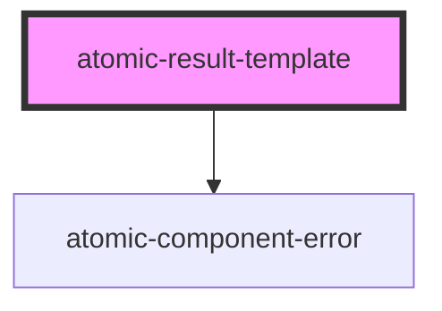

# atomic-result-template

<!-- Auto Generated Below -->

## Properties

| Property     | Attribute | Description                                                                                                                                                                                                                          | Type                        | Default |
| ------------ | --------- | ------------------------------------------------------------------------------------------------------------------------------------------------------------------------------------------------------------------------------------ | --------------------------- | ------- |
| `conditions` | --        | Functions that must return true on results for the result template to apply.  For example, a template with the following only applies to results whose `title` contains `singapore`: `[(result) => /singapore/i.test(result.title)]` | `ResultTemplateCondition[]` | `[]`    |

## Methods

### `getTemplate() => Promise<ResultTemplate<string> | null>`

Gets the appropriate result template based on conditions applied.

#### Returns

Type: `Promise<ResultTemplate<string> | null>`

## Dependencies

### Depends on

- [atomic-component-error](../atomic-component-error)

### Graph

----------------------------------------------

*Built with [StencilJS](https://stenciljs.com/)*
