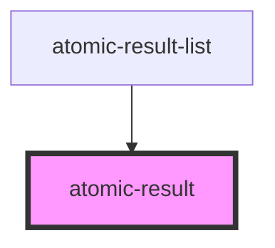

# atomic-result

<!-- Auto Generated Below -->

## Properties

| Property              | Attribute | Description | Type                                                                                                                                                                                                                                                                                                                                                                                                                                                                                                                                                                                                                                                                                                                                                                                                                            | Default     |
| --------------------- | --------- | ----------- | ------------------------------------------------------------------------------------------------------------------------------------------------------------------------------------------------------------------------------------------------------------------------------------------------------------------------------------------------------------------------------------------------------------------------------------------------------------------------------------------------------------------------------------------------------------------------------------------------------------------------------------------------------------------------------------------------------------------------------------------------------------------------------------------------------------------------------- | ----------- |
| `result` _(required)_ | --        |             | `{ title: string; uri: string; printableUri: string; clickUri: string; uniqueId: string; excerpt: string; firstSentences: string; summary: null; flags: string; hasHtmlVersion: boolean; hasMobileHtmlVersion: boolean; score: number; percentScore: number; rankingInfo: null; rating: number; isTopResult: boolean; isRecommendation: boolean; isUserActionView: boolean; titleHighlights: string[]; firstSentencesHighlights: string[]; excerptHighlights: string[]; printableUriHighlights: string[]; summaryHighlights: string[]; parentResult: null; childResults: Result[]; totalNumberOfChildResults: number; absentTerms: string[]; raw: Raw; Title: string; Uri: string; PrintableUri: string; ClickUri: string; UniqueId: string; Excerpt: string; FirstSentences: string; rankingModifier?: string \| undefined; }` | `undefined` |

## Dependencies

### Used by

 - [atomic-result-list](../atomic-result-list)

### Graph

----------------------------------------------

*Built with [StencilJS](https://stenciljs.com/)*
