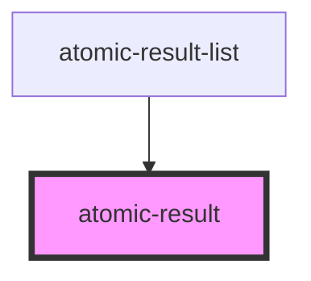

# atomic-result

<!-- Auto Generated Below -->

## Properties

| Property               | Attribute | Description | Type                     | Default     |
| ---------------------- | --------- | ----------- | ------------------------ | ----------- |
| `content` _(required)_ | `content` |             | `string`                 | `undefined` |
| `engine` _(required)_  | --        |             | `Engine<SearchAppState>` | `undefined` |
| `result` _(required)_  | --        |             | `Result`                 | `undefined` |

## Dependencies

### Used by

- [atomic-result-list](../atomic-result-list)

### Graph

---

_Built with [StencilJS](https://stenciljs.com/)_
