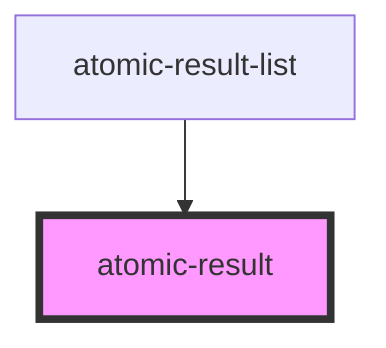

# atomic-result

<!-- Auto Generated Below -->

## Properties

| Property               | Attribute | Description                    | Type                                                    | Default     |
| ---------------------- | --------- | ------------------------------ | ------------------------------------------------------- | ----------- |
| `content` _(required)_ | `content` | The result content to display. | `string`                                                | `undefined` |
| `engine` _(required)_  | --        | The Headless Engine.           | `CoreEngine<SearchAppState, SearchThunkExtraArguments>` | `undefined` |
| `result` _(required)_  | --        | The result item.               | `Result`                                                | `undefined` |

## Dependencies

### Used by

 - [atomic-result-list](../atomic-result-list)

### Graph

----------------------------------------------

*Built with [StencilJS](https://stenciljs.com/)*
