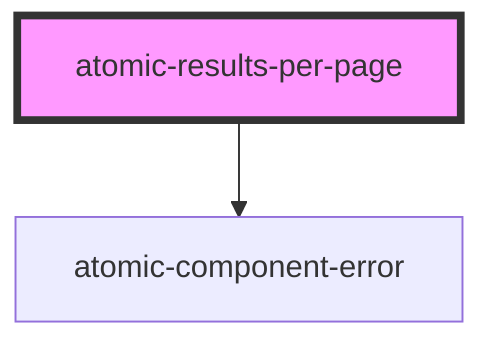

# atomic-results-per-page

<!-- Auto Generated Below -->

## Properties

| Property           | Attribute           | Description                                                                                                                                          | Type                  | Default          |
| ------------------ | ------------------- | ---------------------------------------------------------------------------------------------------------------------------------------------------- | --------------------- | ---------------- |
| `choicesDisplayed` | `choices-displayed` | List of possible results per page choices, separated by commas.                                                                                      | `string`              | `'10,25,50,100'` |
| `initialChoice`    | `initial-choice`    | Initial choice for the number of result per page. Should be part of the `choicesDisplayed` option. By default, the first value of choices displayed. | `number \| undefined` | `undefined`      |

## Shadow Parts

| Part                   | Description                  |
| ---------------------- | ---------------------------- |
| `"active-page-button"` | The active page button       |
| `"buttons"`            | The list of buttons          |
| `"label"`              | The "Results per page" label |
| `"page-button"`        | The page button              |

## CSS Custom Properties

| Name                                       | Description                            |
| ------------------------------------------ | -------------------------------------- |
| `--atomic-pagination-button-border-radius` | Border radius of the pagination button |
| `--atomic-pagination-button-size`          | Size of the pagination buttons         |
| `--atomic-pagination-font-size`            | Font size of the pagination            |

## Dependencies

### Depends on

- [atomic-component-error](../atomic-component-error)

### Graph

----------------------------------------------

*Built with [StencilJS](https://stenciljs.com/)*
