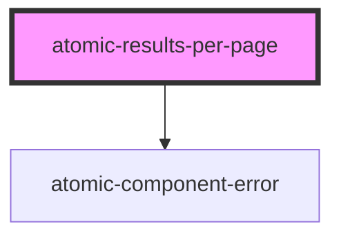

# atomic-results-per-page

<!-- Auto Generated Below -->

## Properties

| Property           | Attribute           | Description                                                                                                                                                                      | Type                  | Default          |
| ------------------ | ------------------- | -------------------------------------------------------------------------------------------------------------------------------------------------------------------------------- | --------------------- | ---------------- |
| `choicesDisplayed` | `choices-displayed` | A list of choices for the number of results to display per page, separated by commas.                                                                                            | `string`              | `'10,25,50,100'` |
| `initialChoice`    | `initial-choice`    | The initial selection for the number of result per page. This should be part of the `choicesDisplayed` option. By default, this is set to the first value in `choicesDisplayed`. | `number \| undefined` | `undefined`      |

## Shadow Parts

| Part                   | Description                   |
| ---------------------- | ----------------------------- |
| `"active-page-button"` | The active page button.       |
| `"buttons"`            | The list of buttons.          |
| `"label"`              | The "Results per page" label. |
| `"page-button"`        | The page button.              |

## CSS Custom Properties

| Name                                       | Description                                 |
| ------------------------------------------ | ------------------------------------------- |
| `--atomic-pagination-button-border-radius` | The border radius of the pagination button. |
| `--atomic-pagination-button-size`          | The size of the pagination buttons.         |
| `--atomic-pagination-font-size`            | The font size of the pagination button.     |

## Dependencies

### Depends on

- [atomic-component-error](../atomic-component-error)

### Graph

----------------------------------------------

*Built with [StencilJS](https://stenciljs.com/)*
