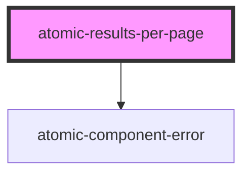

# atomic-results-per-page

<!-- Auto Generated Below -->

## Properties

| Property        | Attribute        | Description                                                    | Type     | Default          |
| --------------- | ---------------- | -------------------------------------------------------------- | -------- | ---------------- |
| `initialOption` | `initial-option` | Initial value of the result per page option                    | `number` | `10`             |
| `options`       | `options`        | List of possible results per page options, separated by commas | `string` | `'10,25,50,100'` |

## Shadow Parts

| Part                   | Description                  |
| ---------------------- | ---------------------------- |
| `"active-page-button"` | The active page button       |
| `"label"`              | The "Results per page" label |
| `"list"`               | The list of buttons          |
| `"page-button"`        | The page button              |

## CSS Custom Properties

| Name                               | Description             |
| ---------------------------------- | ----------------------- |
| `--atomic-pagination-active-color` | Pagination active color |
| `--atomic-pagination-border-color` | Pagination border color |

## Dependencies

### Depends on

- [atomic-component-error](../atomic-component-error)

### Graph

----------------------------------------------

*Built with [StencilJS](https://stenciljs.com/)*
