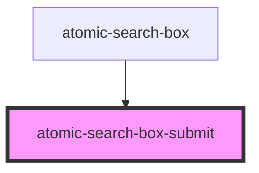

# atomic-search-box-submit

<!-- Auto Generated Below -->

## Properties

| Property                  | Attribute | Description | Type                                                                                                                                                                                                                                                                                           | Default     |
| ------------------------- | --------- | ----------- | ---------------------------------------------------------------------------------------------------------------------------------------------------------------------------------------------------------------------------------------------------------------------------------------------- | ----------- |
| `controller` _(required)_ | --        |             | `{ updateText(value: string): void; clear(): void; hideSuggestions(): void; showSuggestions(): void; selectSuggestion(value: string): void; submit(): void; state: { value: string; suggestions: { value: string; }[]; isLoading: boolean; }; subscribe(listener: () => void): Unsubscribe; }` | `undefined` |

## Slots

| Slot | Description                                  |
| ---- | -------------------------------------------- |
|      | Content is placed inside the button element. |

## Dependencies

### Used by

 - [atomic-search-box](../atomic-search-box)

### Graph

----------------------------------------------

*Built with [StencilJS](https://stenciljs.com/)*
