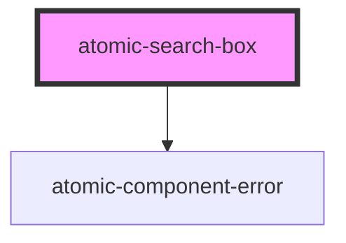

# atomic-search-box
A search box with built in support for query suggestions.

<!-- Auto Generated Below -->

## Properties

| Property              | Attribute               | Description                                                  | Type      | Default |
| --------------------- | ----------------------- | ------------------------------------------------------------ | --------- | ------- |
| `leadingSubmitButton` | `leading-submit-button` | Whether the submit button should be placed before the input. | `boolean` | `false` |
| `numberOfSuggestions` | `number-of-suggestions` | Maximum number of suggestions to display.                    | `number`  | `5`     |
| `placeholder`         | `placeholder`           | The placeholder for the search box input.                    | `string`  | `''`    |

## Shadow Parts

| Part                  | Description                                     |
| --------------------- | ----------------------------------------------- |
| `"active-suggestion"` | The currently active suggestion                 |
| `"clear-button"`      | The clear button for the input of the searchbox |
| `"input-wrapper"`     | The wrapper for the searchbox input             |
| `"search-input"`      | The search box input                            |
| `"submit-button"`     | The search box submit button                    |
| `"suggestion"`        | The suggestion                                  |
| `"suggestions"`       | The list of suggestions                         |

## CSS Custom Properties

| Name                          | Description                                     |
| ----------------------------- | ----------------------------------------------- |
| `--atomic-search-box-height`  | Height of the search box                        |
| `--atomic-submit-button-size` | Size of the submit button inside the search box |

## Dependencies

### Depends on

- [atomic-component-error](../atomic-component-error)

### Graph

----------------------------------------------

*Built with [StencilJS](https://stenciljs.com/)*
