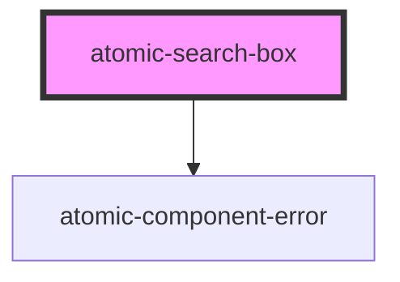

# atomic-search-box
A search box with built in support for query suggestions.

## Styles

A list of pre-defined classes to use to customize the look of a search box

| Class Name            | Description
| --------------------- | ----------------------- 
| `submit-button`       | The search box submit button
| `clear-button`        | The search box input's clear button
| `input`               | The search box input
| `suggestions`         | The list of search suggestions
| `suggestion`          | An individual search suggestion
| `active-suggestion`   | The currently active suggestions

<!-- Auto Generated Below -->

## Properties

| Property              | Attribute               | Description                                                 | Type      | Default                                  |
| --------------------- | ----------------------- | ----------------------------------------------------------- | --------- | ---------------------------------------- |
| `_id`                 | `data-id`               |                                                             | `string`  | `randomID(     'atomic-search-box-'   )` |
| `leadingSubmitButton` | `leading-submit-button` | Whether the submit button should be placed before the input | `boolean` | `false`                                  |
| `numberOfSuggestions` | `number-of-suggestions` | Maximum number of suggestions to display                    | `number`  | `5`                                      |
| `placeholder`         | `placeholder`           | Placeholder text for the search box input                   | `string`  | `''`                                     |

## Dependencies

### Depends on

- [atomic-component-error](../atomic-component-error)

### Graph

----------------------------------------------

*Built with [StencilJS](https://stenciljs.com/)*
