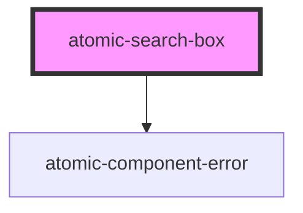

# atomic-search-box
A search box with built in support for query suggestions.

<!-- Auto Generated Below -->

## Properties

| Property              | Attribute               | Description                                                 | Type      | Default                                  |
| --------------------- | ----------------------- | ----------------------------------------------------------- | --------- | ---------------------------------------- |
| `_id`                 | `data-id`               |                                                             | `string`  | `randomID(     'atomic-search-box-'   )` |
| `leadingSubmitButton` | `leading-submit-button` | Whether the submit button should be placed before the input | `boolean` | `false`                                  |
| `numberOfSuggestions` | `number-of-suggestions` | Maximum number of suggestions to display                    | `number`  | `5`                                      |
| `placeholder`         | `placeholder`           |                                                             | `string`  | `''`                                     |

## Shadow Parts

| Part                  | Description                         |
| --------------------- | ----------------------------------- |
| `"active-suggestion"` | The currently active suggestion     |
| `"clear-button"`      | The search box input's clear button |
| `"input"`             | The search box input                |
| `"submit-button"`     | The search box submit button        |
| `"suggestion"`        | The suggestion                      |
| `"suggestions"`       | The list of suggestions             |

## Dependencies

### Depends on

- [atomic-component-error](../atomic-component-error)

### Graph

----------------------------------------------

*Built with [StencilJS](https://stenciljs.com/)*
