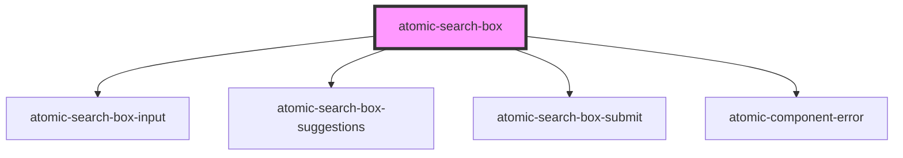

# atomic-search-box

<!-- Auto Generated Below -->

## Properties

| Property              | Attribute               | Description | Type     | Default |
| --------------------- | ----------------------- | ----------- | -------- | ------- |
| `numberOfSuggestions` | `number-of-suggestions` |             | `number` | `5`     |

## Dependencies

### Depends on

- [atomic-search-box-input](../atomic-search-box-input)
- [atomic-search-box-suggestions](../atomic-search-box-suggestions)
- [atomic-search-box-submit](../atomic-search-box-submit)
- [atomic-component-error](../atomic-component-error)

### Graph

----------------------------------------------

*Built with [StencilJS](https://stenciljs.com/)*
