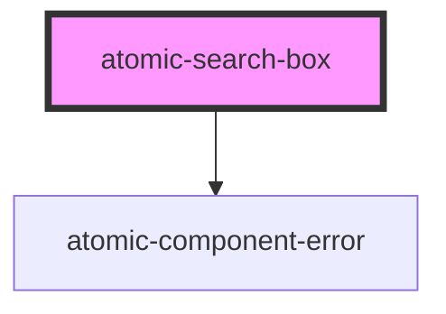

# atomic-search-box

<!-- Auto Generated Below -->

## Properties

| Property              | Attribute               | Description | Type      | Default |
| --------------------- | ----------------------- | ----------- | --------- | ------- |
| `isStandalone`        | `is-standalone`         |             | `boolean` | `false` |
| `numberOfSuggestions` | `number-of-suggestions` |             | `number`  | `5`     |

## Dependencies

### Depends on

- [atomic-component-error](../atomic-component-error)

### Graph

----------------------------------------------

*Built with [StencilJS](https://stenciljs.com/)*
