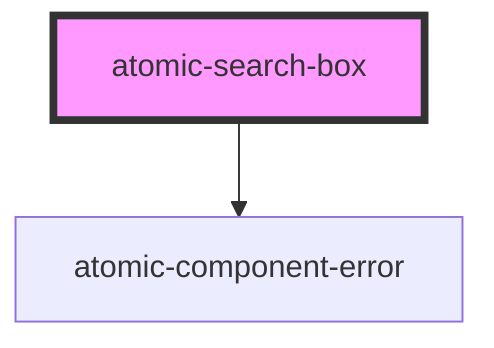

# atomic-search-box
A search box with built in support for query suggestions.

<!-- Auto Generated Below -->

## Properties

| Property              | Attribute               | Description                                                   | Type      | Default |
| --------------------- | ----------------------- | ------------------------------------------------------------- | --------- | ------- |
| `leadingSubmitButton` | `leading-submit-button` | Whether the submit button is placed before the input.         | `boolean` | `false` |
| `numberOfSuggestions` | `number-of-suggestions` | The maximum number of suggestions to display.                 | `number`  | `5`     |
| `placeholder`         | `placeholder`           | The placeholder text to display in the search box input area. | `string`  | `''`    |

## Shadow Parts

| Part                  | Description                                  |
| --------------------- | -------------------------------------------- |
| `"active-suggestion"` | The currently active suggestion.             |
| `"clear-button"`      | The button to clear the search box of input. |
| `"input-wrapper"`     | The wrapper for the searchbox input area.    |
| `"search-input"`      | The search box input.                        |
| `"submit-button"`     | The search box submit button.                |
| `"suggestion"`        | A suggested query correction.                |
| `"suggestions"`       | A list of suggested query corrections.       |

## CSS Custom Properties

| Name                          | Description                                          |
| ----------------------------- | ---------------------------------------------------- |
| `--atomic-search-box-height`  | The height of the search box.                        |
| `--atomic-submit-button-size` | The size of the submit button inside the search box. |

## Dependencies

### Depends on

- [atomic-component-error](../atomic-component-error)

### Graph

----------------------------------------------

*Built with [StencilJS](https://stenciljs.com/)*
