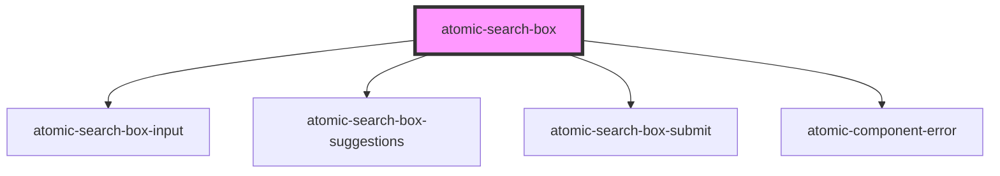

# atomic-search-box


<!-- Auto Generated Below -->


## Usage

### Example

```html
<!-- Default with props -->
<atomic-search-box number-of-suggestions=10></atomic-search-box>

<!-- Search box with a leading submit button -->
<atomic-search-box>
  <atomic-search-box-submit slot="submit-leading"></atomic-search-box-submit>
</atomic-search-box>
```


## Properties

| Property              | Attribute               | Description | Type     | Default |
| --------------------- | ----------------------- | ----------- | -------- | ------- |
| `numberOfSuggestions` | `number-of-suggestions` |             | `number` | `5`     |


## Slots

| Slot               | Description                                      |
| ------------------ | ------------------------------------------------ |
| `"input"`          | Input that contains the query.                   |
| `"submit"`         | Submit button placed after the input.            |
| `"submit-leading"` | Submit button placed before the input.           |
| `"suggestions"`    | List of suggestions placed underneath the input. |


## Dependencies

### Depends on

- [atomic-search-box-input](../atomic-search-box-input)
- [atomic-search-box-suggestions](../atomic-search-box-suggestions)
- [atomic-search-box-submit](../atomic-search-box-submit)
- [atomic-component-error](../atomic-component-error)

### Graph


----------------------------------------------

*Built with [StencilJS](https://stenciljs.com/)*
