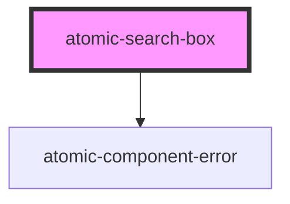

# atomic-search-box


<!-- Auto Generated Below -->


## Usage

### Example

```html
<!-- Default with props -->
<atomic-search-box number-of-suggestions=10></atomic-search-box>

<!-- Search box with a slot for the submit button's content -->
<atomic-search-box>
  <span slot="submit-button">Go! 😊</span>
</atomic-search-box>
```


## Properties

| Property              | Attribute               | Description                                               | Type      | Default                                  |
| --------------------- | ----------------------- | --------------------------------------------------------- | --------- | ---------------------------------------- |
| `_id`                 | `data-id`               |                                                           | `string`  | `randomID(     'atomic-search-box-'   )` |
| `leadingSubmitButton` | `leading-submit-button` | Wether the submit button should be place before the input | `boolean` | `false`                                  |
| `numberOfSuggestions` | `number-of-suggestions` | Maximum number of suggestions to display                  | `number`  | `5`                                      |


## Slots

| Slot              | Description                         |
| ----------------- | ----------------------------------- |
| `"clear-button"`  | Content of the input's clear button |
| `"submit-button"` | Content of the submit button        |


## Shadow Parts

| Part                  | Description                         |
| --------------------- | ----------------------------------- |
| `"active-suggestion"` | The currently active suggestion     |
| `"clear-button"`      | The search box input's clear button |
| `"input"`             | The search box input                |
| `"submit-button"`     | The search box submit button        |
| `"suggestion"`        | The suggestion                      |
| `"suggestions"`       | The list of suggestions             |


## Dependencies

### Depends on

- [atomic-component-error](../atomic-component-error)

### Graph


----------------------------------------------

*Built with [StencilJS](https://stenciljs.com/)*
