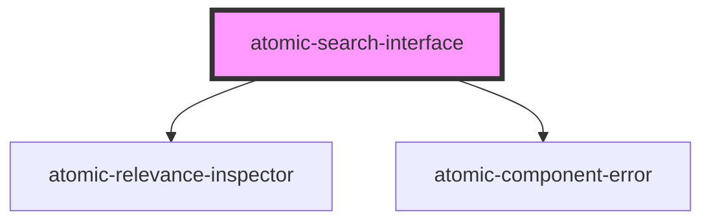

# atomic-search-interface

<!-- Auto Generated Below -->

## Properties

| Property    | Attribute    | Description | Type                                                                                    | Default     |
| ----------- | ------------ | ----------- | --------------------------------------------------------------------------------------- | ----------- |
| `logLevel`  | `log-level`  |             | `"debug" \| "error" \| "fatal" \| "info" \| "silent" \| "trace" \| "warn" \| undefined` | `'warn'`    |
| `pipeline`  | `pipeline`   |             | `string`                                                                                | `'default'` |
| `sample`    | `sample`     |             | `boolean`                                                                               | `false`     |
| `searchHub` | `search-hub` |             | `string`                                                                                | `'default'` |

## Methods

### `initialize(options: Pick<HeadlessConfigurationOptions, 'accessToken' | 'organizationId' | 'renewAccessToken' | 'platformUrl'>) => Promise<void>`

#### Returns

Type: `Promise<void>`

## Dependencies

### Depends on

- [atomic-relevance-inspector](../atomic-relevance-inspector)
- [atomic-component-error](../atomic-component-error)

### Graph

----------------------------------------------

*Built with [StencilJS](https://stenciljs.com/)*
