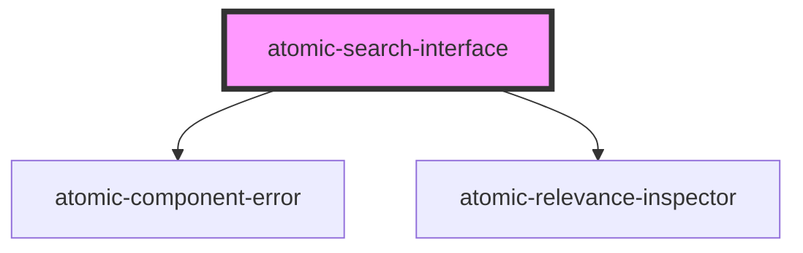

# atomic-search-interface

<!-- Auto Generated Below -->

## Properties

| Property            | Attribute              | Description | Type                                                                                    | Default                    |
| ------------------- | ---------------------- | ----------- | --------------------------------------------------------------------------------------- | -------------------------- |
| `engine`            | --                     |             | `Engine<SearchAppState> \| undefined`                                                   | `undefined`                |
| `i18n`              | --                     |             | `i18n`                                                                                  | `i18next.createInstance()` |
| `language`          | `language`             |             | `string`                                                                                | `'en'`                     |
| `logLevel`          | `log-level`            |             | `"debug" \| "error" \| "fatal" \| "info" \| "silent" \| "trace" \| "warn" \| undefined` | `undefined`                |
| `pipeline`          | `pipeline`             |             | `string`                                                                                | `'default'`                |
| `reflectStateInUrl` | `reflect-state-in-url` |             | `boolean`                                                                               | `true`                     |
| `searchHub`         | `search-hub`           |             | `string`                                                                                | `'default'`                |

## Methods

### `executeFirstSearch() => Promise<void>`

#### Returns

Type: `Promise<void>`

### `initialize(options: InitializationOptions) => Promise<void>`

#### Returns

Type: `Promise<void>`

## Dependencies

### Depends on

- [atomic-component-error](../atomic-component-error)
- [atomic-relevance-inspector](../atomic-relevance-inspector)

### Graph

---

_Built with [StencilJS](https://stenciljs.com/)_
