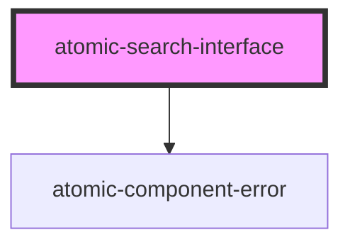

# atomic-search-interface

<!-- Auto Generated Below -->

## Properties

| Property           | Attribute         | Description | Type                                   | Default     |
| ------------------ | ----------------- | ----------- | -------------------------------------- | ----------- |
| `accessToken`      | `access-token`    |             | `string \| undefined`                  | `undefined` |
| `organizationId`   | `organization-id` |             | `string \| undefined`                  | `undefined` |
| `renewAccessToken` | --                |             | `(() => Promise<string>) \| undefined` | `undefined` |
| `sample`           | `sample`          |             | `boolean`                              | `false`     |

## Dependencies

### Depends on

- [atomic-component-error](../atomic-component-error)

### Graph

----------------------------------------------

*Built with [StencilJS](https://stenciljs.com/)*
