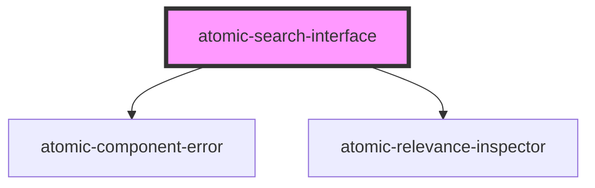

# atomic-search-interface

<!-- Auto Generated Below -->

## Properties

| Property            | Attribute              | Description                                                            | Type                                                                                    | Default                    |
| ------------------- | ---------------------- | ---------------------------------------------------------------------- | --------------------------------------------------------------------------------------- | -------------------------- |
| `engine`            | --                     | The search interface Headless engine.                                  | `Engine<SearchAppState> \| undefined`                                                   | `undefined`                |
| `i18n`              | --                     | The search interface i18next instance.                                 | `i18n`                                                                                  | `i18next.createInstance()` |
| `language`          | `language`             | The search interface language.                                         | `string`                                                                                | `'en'`                     |
| `logLevel`          | `log-level`            | The severity level of the messages to log in the console.              | `"debug" \| "error" \| "fatal" \| "info" \| "silent" \| "trace" \| "warn" \| undefined` | `undefined`                |
| `pipeline`          | `pipeline`             | The search interface [query pipeline](https://docs.coveo.com/en/180/). | `string`                                                                                | `'default'`                |
| `reflectStateInUrl` | `reflect-state-in-url` | Whether the state should be reflected in the URL parameters.           | `boolean`                                                                               | `true`                     |
| `searchHub`         | `search-hub`           | The search interface [search hub](https://docs.coveo.com/en/1342/).    | `string`                                                                                | `'default'`                |

## Methods

### `executeFirstSearch() => Promise<void>`

Executes the first search and logs the interface load event to analytics, after initializing connection to the Headless engine.

#### Returns

Type: `Promise<void>`

### `initialize(options: InitializationOptions) => Promise<void>`

Initializes the connection with the Headless engine using options for `accessToken` (required), `organizationId` (required), `renewAccessToken`, and `platformUrl`.

#### Returns

Type: `Promise<void>`

## Dependencies

### Depends on

- [atomic-component-error](../atomic-component-error)
- [atomic-relevance-inspector](../atomic-relevance-inspector)

### Graph

----------------------------------------------

*Built with [StencilJS](https://stenciljs.com/)*
