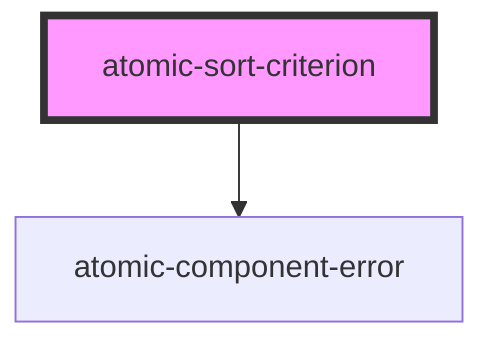

# atomic-sort-criterion

<!-- Auto Generated Below -->

## Properties

| Property                 | Attribute | Description                                                                                                                                                                                                                                                                                                                                                                                                                                                                                                                                                                                                                                                                                                                                                                        | Type                                                                                                                                                                             | Default     |
| ------------------------ | --------- | ---------------------------------------------------------------------------------------------------------------------------------------------------------------------------------------------------------------------------------------------------------------------------------------------------------------------------------------------------------------------------------------------------------------------------------------------------------------------------------------------------------------------------------------------------------------------------------------------------------------------------------------------------------------------------------------------------------------------------------------------------------------------------------- | -------------------------------------------------------------------------------------------------------------------------------------------------------------------------------- | ----------- |
| `by` _(required)_        | `by`      | The available criteria that can be used to sort query results.  - `relevancy`: Uses standard index ranking factors (adjacency, TDIDF) and custom ranking expressions (QREs and QRFs) to compute a ranking score for each query result item, and sorts the query results by descending score value. - `qre`: Uses only custom ranking expressions (QREs and QRFs) to compute a ranking score for each query result item, and sorts the query results by descending score value. - `date`: Uses the date field to sort the query results. This field typically contains the last modification date of each item. May be in ascending or descending order. - `field`: Uses the value of a specific sortable field to sort the query results. May be in ascending or descending order. | `SortBy.Date \| SortBy.Field \| SortBy.NoSort \| SortBy.QRE \| SortBy.Relevancy`                                                                                                 | `undefined` |
| `caption` _(required)_   | `caption` | The non-localized caption to display for this criteria.                                                                                                                                                                                                                                                                                                                                                                                                                                                                                                                                                                                                                                                                                                                            | `string`                                                                                                                                                                         | `undefined` |
| `criterion` _(required)_ | --        | Validated sort criterion. `null` when invalid. For development purposes, not meant to be specified by users.                                                                                                                                                                                                                                                                                                                                                                                                                                                                                                                                                                                                                                                                       | `{ by: SortBy.Date; order: SortOrder; } \| { by: SortBy.Field; field: string; order: SortOrder; } \| { by: SortBy.NoSort; } \| { by: SortBy.QRE; } \| { by: SortBy.Relevancy; }` | `undefined` |
| `field`                  | `field`   | The sortable field on which to sort when `by` is `field`.                                                                                                                                                                                                                                                                                                                                                                                                                                                                                                                                                                                                                                                                                                                          | `string \| undefined`                                                                                                                                                            | `undefined` |
| `order`                  | `order`   | The available sort orders: `ascending` or `descending`/                                                                                                                                                                                                                                                                                                                                                                                                                                                                                                                                                                                                                                                                                                                            | `SortOrder.Ascending \| SortOrder.Descending \| undefined`                                                                                                                       | `undefined` |

## Dependencies

### Depends on

- [atomic-component-error](../atomic-component-error)

### Graph

----------------------------------------------

*Built with [StencilJS](https://stenciljs.com/)*
