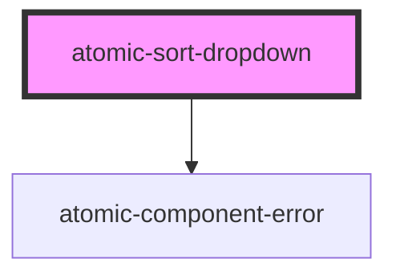

# atomic-sort-dropdown

<!-- Auto Generated Below -->

## Properties

| Property       | Attribute       | Description                                                             | Type      | Default |
| -------------- | --------------- | ----------------------------------------------------------------------- | --------- | ------- |
| `displayLabel` | `display-label` | Specifies whether a label should be displayed in front of the dropdown. | `boolean` | `true`  |

## Shadow Parts

| Part       | Description         |
| ---------- | ------------------- |
| `"label"`  | The "Sort by" label |
| `"select"` | The select element  |

## Dependencies

### Depends on

- [atomic-component-error](../atomic-component-error)

### Graph

----------------------------------------------

*Built with [StencilJS](https://stenciljs.com/)*
