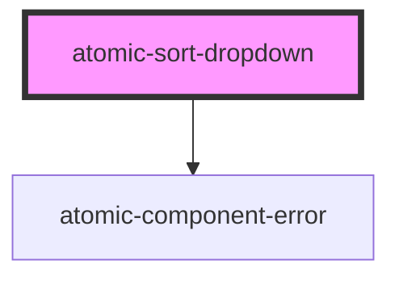

# atomic-sort-dropdown

<!-- Auto Generated Below -->

## Shadow Parts

| Part            | Description                                                               |
| --------------- | ------------------------------------------------------------------------- |
| `"label"`       | The "Sort by" label of the `<select>` element.                            |
| `"placeholder"` | The drop-down placeholder for while the search interface is initializing. |
| `"select"`      | The `<select>` element of the drop-down list.                             |

## Dependencies

### Depends on

- [atomic-component-error](../atomic-component-error)

### Graph

----------------------------------------------

*Built with [StencilJS](https://stenciljs.com/)*
