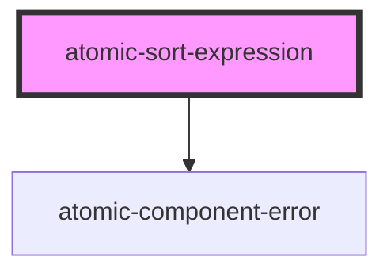

# atomic-sort-expression

<!-- Auto Generated Below -->

## Properties

| Property                  | Attribute    | Description                                                                                                                                                                                                                                                                                                                                                                                                                                                                                          | Type     | Default     |
| ------------------------- | ------------ | ---------------------------------------------------------------------------------------------------------------------------------------------------------------------------------------------------------------------------------------------------------------------------------------------------------------------------------------------------------------------------------------------------------------------------------------------------------------------------------------------------- | -------- | ----------- |
| `caption` _(required)_    | `caption`    | The non-localized caption to display for this expression.                                                                                                                                                                                                                                                                                                                                                                                                                                            | `string` | `undefined` |
| `expression` _(required)_ | `expression` | The sort criterion/criteria expression the end user can select/toggle between.  The available sort criteria are: - `relevancy` - `date ascending`/`date descending` - `qre` - `field ascending`/`field descending`, where you must replace `field` with the name of a sortable field in your index (e.g., `criteria="size ascending"`).  You can specify multiple sort criteria to be used in the same request by separating them with a comma (e.g., `criteria="size ascending, date ascending"` ). | `string` | `undefined` |

## Dependencies

### Depends on

- [atomic-component-error](../atomic-component-error)

### Graph

----------------------------------------------

*Built with [StencilJS](https://stenciljs.com/)*
