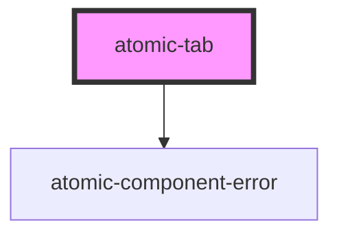

# atomic-tab

<!-- Auto Generated Below -->

## Properties

| Property     | Attribute    | Description | Type                                  | Default     |
| ------------ | ------------ | ----------- | ------------------------------------- | ----------- |
| `engine`     | --           |             | `Engine<SearchAppState> \| undefined` | `undefined` |
| `expression` | `expression` |             | `string`                              | `''`        |
| `isActive`   | `is-active`  |             | `boolean`                             | `false`     |

## Shadow Parts

| Part           | Description    |
| -------------- | -------------- |
| `"active-tab"` | The active tab |
| `"tab-button"` | The tab button |

## Dependencies

### Depends on

- [atomic-component-error](../atomic-component-error)

### Graph

----------------------------------------------

*Built with [StencilJS](https://stenciljs.com/)*
