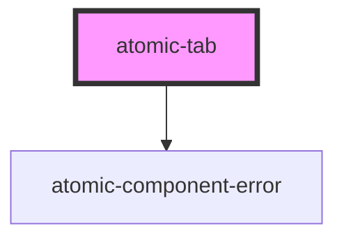

# atomic-tab

<!-- Auto Generated Below -->

## Properties

| Property     | Attribute    | Description                                                                                                       | Type      | Default |
| ------------ | ------------ | ----------------------------------------------------------------------------------------------------------------- | --------- | ------- |
| `expression` | `expression` | The advanced expression or filter that the Tab should add to any outgoing query.  Example: `@objecttype==Message` | `string`  | `''`    |
| `isActive`   | `is-active`  | Whether the tab is set to active.                                                                                 | `boolean` | `false` |

## Shadow Parts

| Part           | Description    |
| -------------- | -------------- |
| `"active-tab"` | The active tab |
| `"tab-button"` | The tab button |

## Dependencies

### Depends on

- [atomic-component-error](../atomic-component-error)

### Graph

----------------------------------------------

*Built with [StencilJS](https://stenciljs.com/)*
