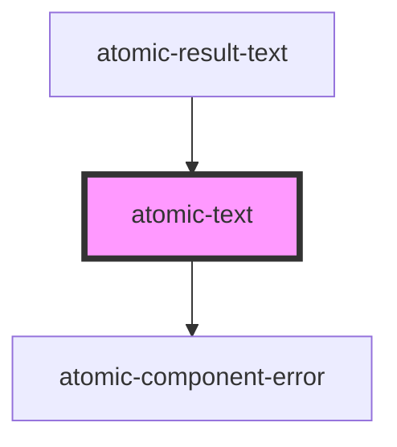

# atomic-text

<!-- Auto Generated Below -->

## Properties

| Property             | Attribute | Description                       | Type                  | Default     |
| -------------------- | --------- | --------------------------------- | --------------------- | ----------- |
| `count`              | `count`   | The count value used for plurals. | `number \| undefined` | `undefined` |
| `value` _(required)_ | `value`   | The string key value.             | `string`              | `undefined` |

## Dependencies

### Used by

 - [atomic-result-text](../result-template-components/atomic-result-text)

### Depends on

- [atomic-component-error](../atomic-component-error)

### Graph

----------------------------------------------

*Built with [StencilJS](https://stenciljs.com/)*
