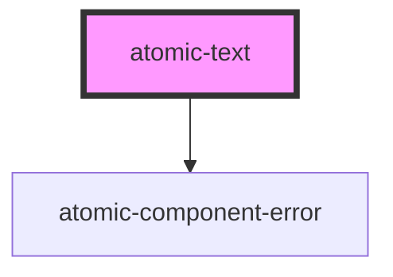

# atomic-text

<!-- Auto Generated Below -->

## Properties

| Property             | Attribute | Description                         | Type                  | Default     |
| -------------------- | --------- | ----------------------------------- | --------------------- | ----------- |
| `context`            | `context` | Used for contexts (eg. male/female) | `string \| undefined` | `undefined` |
| `count`              | `count`   | Count value used for plurals        | `number \| undefined` | `undefined` |
| `value` _(required)_ | `value`   | String key value                    | `string`              | `undefined` |

## Dependencies

### Depends on

- [atomic-component-error](../atomic-component-error)

### Graph

----------------------------------------------

*Built with [StencilJS](https://stenciljs.com/)*
