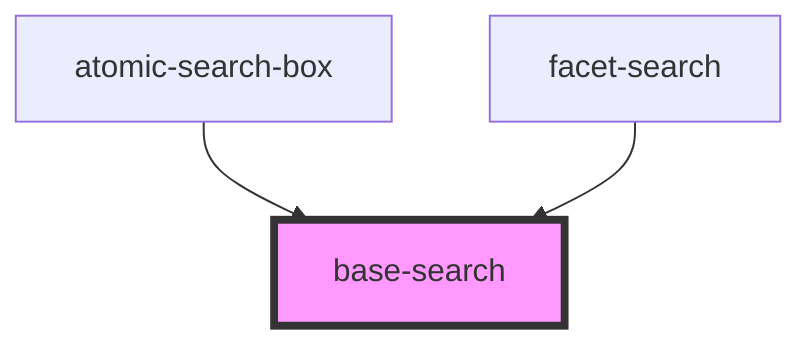

# base-search

#This is an internal component and is not intended to be used.

<!-- Auto Generated Below -->

## Properties

| Property                        | Attribute               | Description | Type                             | Default     |
| ------------------------------- | ----------------------- | ----------- | -------------------------------- | ----------- |
| `_id` _(required)_              | `_id`                   |             | `string`                         | `undefined` |
| `hideSubmitButton`              | `hide-submit-button`    |             | `boolean`                        | `false`     |
| `leadingSubmitButton`           | `leading-submit-button` |             | `boolean`                        | `false`     |
| `moreValuesAvailable`           | `more-values-available` |             | `boolean`                        | `false`     |
| `placeholder`                   | `placeholder`           |             | `string`                         | `''`        |
| `strings` _(required)_          | --                      |             | `{ [x: string]: () => string; }` | `undefined` |
| `suggestionValues` _(required)_ | --                      |             | `{ value: string; }[]`           | `undefined` |
| `value` _(required)_            | `value`                 |             | `string`                         | `undefined` |

## Events

| Event             | Description | Type                  |
| ----------------- | ----------- | --------------------- |
| `clear`           |             | `CustomEvent<void>`   |
| `search`          |             | `CustomEvent<void>`   |
| `selectValue`     |             | `CustomEvent<number>` |
| `showMoreResults` |             | `CustomEvent<void>`   |
| `textChange`      |             | `CustomEvent<string>` |

## Shadow Parts

| Part              | Description |
| ----------------- | ----------- |
| `"clear-button"`  |             |
| `"search-input"`  |             |
| `"submit-button"` |             |
| `"suggestion"`    |             |
| `"suggestions"`   |             |

## Dependencies

### Used by

 - [atomic-search-box](../atomic-search-box)
 - [facet-search](../facets/facet-search)

### Graph

----------------------------------------------

*Built with [StencilJS](https://stenciljs.com/)*
