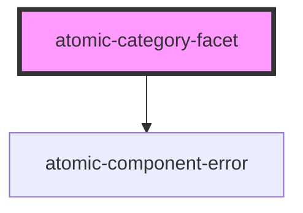

# atomic-category-facet

A hierarchical category facet component. It is displayed as a facet in desktop browsers and as a button which opens a facet modal in mobile browsers.

<!-- Auto Generated Below -->

## Properties

| Property              | Attribute              | Description                                                                                                                                                                                                    | Type                              | Default         |
| --------------------- | ---------------------- | -------------------------------------------------------------------------------------------------------------------------------------------------------------------------------------------------------------- | --------------------------------- | --------------- |
| `basePath`            | `base-path`            | The base path shared by all values for the facet, separated by commas.                                                                                                                                         | `string`                          | `''`            |
| `delimitingCharacter` | `delimiting-character` | The character that separates values of a multi-value field                                                                                                                                                     | `string`                          | `';'`           |
| `enableFacetSearch`   | `enable-facet-search`  | Whether this facet should contain a search box.                                                                                                                                                                | `boolean`                         | `false`         |
| `facetId`             | `facet-id`             |                                                                                                                                                                                                                | `string`                          | `''`            |
| `field`               | `field`                | Specifies the index field whose values the facet should use                                                                                                                                                    | `string`                          | `''`            |
| `filterByBasePath`    | `filter-by-base-path`  | Whether to use basePath as a filter for the results.                                                                                                                                                           | `boolean`                         | `true`          |
| `label`               | `label`                | The non-localized label for the facet                                                                                                                                                                          | `string`                          | `'noLabel'`     |
| `numberOfValues`      | `number-of-values`     | The number of values to request for this facet. Also determines the number of additional values to request each time this facet is expanded, and the number of values to display when this facet is collapsed. | `number`                          | `5`             |
| `sortCriteria`        | `sort-criteria`        | The sort criterion to apply to the returned facet values. Possible values are 'alphanumeric', and 'occurrences''.                                                                                              | `"alphanumeric" \| "occurrences"` | `'occurrences'` |

## Shadow Parts

| Part                          | Description                                                        |
| ----------------------------- | ------------------------------------------------------------------ |
| `"active-parent"`             | The currently active parent element                                |
| `"active-search-result"`      | The currently active search result                                 |
| `"child"`                     | A child element                                                    |
| `"clear-button"`              | The button that resets the actively selected facet values          |
| `"close-button"`              | The button to close the facet when displayed modally (mobile only) |
| `"facet"`                     | The wrapper for the entire facet                                   |
| `"parent"`                    | A parent element                                                   |
| `"placeholder"`               | The placeholder shown before the first search is executed. parent  |
| `"search-icon"`               | The magnifier icon of the input                                    |
| `"search-input"`              | The search input                                                   |
| `"search-input-clear-button"` | The clear button of the input                                      |
| `"search-result"`             | A search result                                                    |
| `"search-results"`            | The list of search results                                         |
| `"show-less"`                 | The show less button                                               |
| `"show-more"`                 | The show more results button                                       |
| `"value-count"`               | The facet value count                                              |
| `"value-label"`               | The facet value label                                              |

## Dependencies

### Depends on

- [atomic-component-error](../../atomic-component-error)

### Graph

----------------------------------------------

*Built with [StencilJS](https://stenciljs.com/)*
