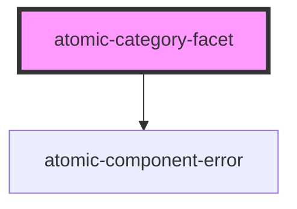

# atomic-category-facet

A hierarchical category facet component. It is displayed as a facet in desktop browsers and as a button which opens a facet modal in mobile browsers.

<!-- Auto Generated Below -->

## Properties

| Property              | Attribute              | Description                                                                                                                                                                                                    | Type                              | Default         |
| --------------------- | ---------------------- | -------------------------------------------------------------------------------------------------------------------------------------------------------------------------------------------------------------- | --------------------------------- | --------------- |
| `delimitingCharacter` | `delimiting-character` | The character that separates values of a multi-value field                                                                                                                                                     | `string`                          | `';'`           |
| `enableFacetSearch`   | `enable-facet-search`  | Whether this facet should contain a search box.                                                                                                                                                                | `boolean`                         | `false`         |
| `field`               | `field`                | Specifies the index field whose values the facet should use                                                                                                                                                    | `string`                          | `''`            |
| `label`               | `label`                | The non-localized label for the facet                                                                                                                                                                          | `string`                          | `'No label'`    |
| `numberOfValues`      | `number-of-values`     | The number of values to request for this facet. Also determines the number of additional values to request each time this facet is expanded, and the number of values to display when this facet is collapsed. | `number`                          | `5`             |
| `sortCriteria`        | `sort-criteria`        | The sort criterion to apply to the returned facet values. Possible values are 'alphanumeric', and 'occurrences''.                                                                                              | `"alphanumeric" \| "occurrences"` | `'occurrences'` |

## Shadow Parts

| Part             | Description                                                        |
| ---------------- | ------------------------------------------------------------------ |
| `"close-button"` | The button to close the facet when displayed modally (mobile only) |
| `"facet"`        | The wrapping div for the entire facet                              |
| `"facet-value"`  | A single facet value                                               |
| `"facet-values"` | The list of facet values (children)                                |
| `"parents"`      |                                                                    |
| `"reset-button"` | The button that resets the actively selected facet values          |
| `"show-less"`    | The show less button                                               |
| `"show-more"`    | The show more results button                                       |

## Dependencies

### Depends on

- [atomic-component-error](../../atomic-component-error)

### Graph

---

_Built with [StencilJS](https://stenciljs.com/)_
