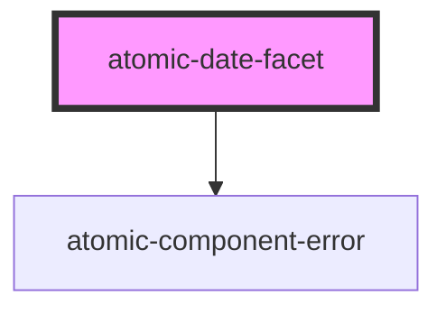

# atomic-date-facet

A facet who's values are expressed as date ranges. It is displayed as a regular facet in desktop browsers and as
a button which opens a facet modal in mobile browsers.

<!-- Auto Generated Below -->

## Properties

| Property         | Attribute          | Description                                                                                                          | Type     | Default        |
| ---------------- | ------------------ | -------------------------------------------------------------------------------------------------------------------- | -------- | -------------- |
| `dateFormat`     | `date-format`      | The format that the date will be displayed in. See https://day.js.org/docs/en/display/format for formatting details. | `string` | `'DD/MM/YYYY'` |
| `facetId`        | `facet-id`         |                                                                                                                      | `string` | `''`           |
| `field`          | `field`            | Specifies the index field whose values the facet should use                                                          | `string` | `''`           |
| `label`          | `label`            | The non-localized label for the facet                                                                                | `string` | `'noLabel'`    |
| `numberOfValues` | `number-of-values` | The number of values to request for this facet, when there are no manual ranges.                                     | `number` | `10`           |

## Shadow Parts

| Part             | Description                                                        |
| ---------------- | ------------------------------------------------------------------ |
| `"clear-button"` | The button that resets the actively selected facet values          |
| `"close-button"` | The button to close the facet when displayed modally (mobile only) |
| `"facet"`        | The wrapper for the entire facet                                   |
| `"placeholder"`  | The placeholder shown before the first search is executed.         |
| `"value"`        | A single facet value                                               |
| `"value-count"`  | The facet value count                                              |
| `"value-label"`  | The facet value label                                              |

## Dependencies

### Depends on

- [atomic-component-error](../../atomic-component-error)

### Graph

----------------------------------------------

*Built with [StencilJS](https://stenciljs.com/)*
