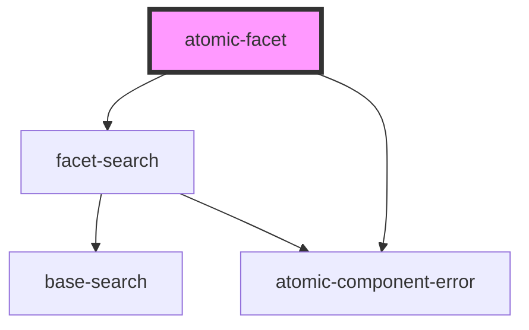

# atomic-facet

A facet component. It is displayed as a facet in desktop browsers and as a button which opens a facet modal in mobile browsers.

<!-- Auto Generated Below -->

## Properties

| Property  | Attribute  | Description | Type     | Default      |
| --------- | ---------- | ----------- | -------- | ------------ |
| `facetId` | `facet-id` |             | `string` | `''`         |
| `field`   | `field`    |             | `string` | `''`         |
| `label`   | `label`    |             | `string` | `'No label'` |

## Shadow Parts

| Part             | Description                                                        |
| ---------------- | ------------------------------------------------------------------ |
| `"close-button"` | The button to close the facet when displayed modally (mobile only) |
| `"facet"`        | The wrapping div for the entire facet                              |
| `"facet-value"`  | A single facet value                                               |
| `"facet-values"` | The list of facet values                                           |
| `"reset-button"` | The button that resets the actively selected facet values          |
| `"show-less"`    | The show less button                                               |
| `"show-more"`    | The show more results button                                       |

## Dependencies

### Depends on

- [facet-search](../facet-search)
- [atomic-component-error](../../atomic-component-error)

### Graph

----------------------------------------------

*Built with [StencilJS](https://stenciljs.com/)*
