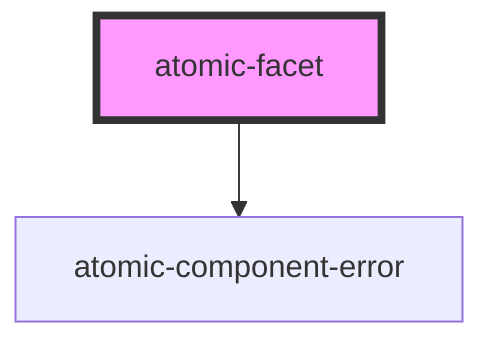

# atomic-facet

<!-- Auto Generated Below -->

## Properties

| Property              | Attribute              | Description                                                                                                                                                                                                    | Type                  | Default      |
| --------------------- | ---------------------- | -------------------------------------------------------------------------------------------------------------------------------------------------------------------------------------------------------------- | --------------------- | ------------ |
| `delimitingCharacter` | `delimiting-character` | The character that separates values of a multi-value field                                                                                                                                                     | `string \| undefined` | `undefined`  |
| `field`               | `field`                | The field whose values you want to display in the facet.                                                                                                                                                       | `string`              | `''`         |
| `label`               | `label`                | The displayed label for the facet.                                                                                                                                                                             | `string`              | `'No label'` |
| `numberOfValues`      | `number-of-values`     | The number of values to request for this facet. Also determines the number of additional values to request each time this facet is expanded, and the number of values to display when this facet is collapsed. | `number`              | `10`         |

## Dependencies

### Depends on

- [atomic-component-error](../../atomic-component-error)

### Graph

----------------------------------------------

*Built with [StencilJS](https://stenciljs.com/)*
