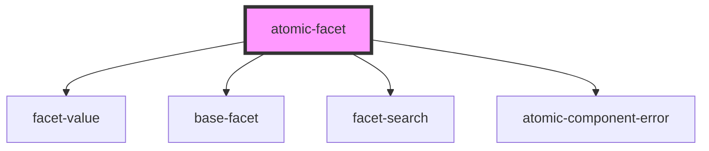

# atomic-facet

<!-- Auto Generated Below -->

## Properties

| Property  | Attribute  | Description | Type     | Default      |
| --------- | ---------- | ----------- | -------- | ------------ |
| `facetId` | `facet-id` |             | `string` | `''`         |
| `field`   | `field`    |             | `string` | `''`         |
| `label`   | `label`    |             | `string` | `'No label'` |

## Dependencies

### Depends on

- [facet-value](../facet-value)
- [base-facet](../base-facet)
- [facet-search](../facet-search)
- [atomic-component-error](../../atomic-component-error)

### Graph

----------------------------------------------

*Built with [StencilJS](https://stenciljs.com/)*
