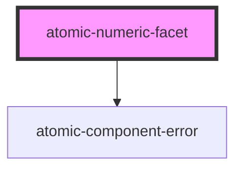

# atomic-numeric-facet

A facet who's values are expressed as numeric ranges. 
It is displayed as a regular facet in desktop browsers and as a button which opens a facet modal in mobile browsers.

<!-- Auto Generated Below -->

## Properties

| Property                  | Attribute                   | Description                                                                  | Type      | Default      |
| ------------------------- | --------------------------- | ---------------------------------------------------------------------------- | --------- | ------------ |
| `facetId`                 | `facet-id`                  |                                                                              | `string`  | `''`         |
| `field`                   | `field`                     | Specifies the index field whose values the facet should use                  | `string`  | `''`         |
| `generateAutomaticRanges` | `generate-automatic-ranges` | Whether or not the index should automatically generate options for the facet | `boolean` | `true`       |
| `label`                   | `label`                     | The displayed label for the facet                                            | `string`  | `'No label'` |

## Shadow Parts

| Part                  | Description                                                        |
| --------------------- | ------------------------------------------------------------------ |
| `"active-suggestion"` | The currently highlighted facet search result                      |
| `"clear-button"`      | The facet search input's clear button                              |
| `"close-button"`      | The button to close the facet when displayed modally (mobile only) |
| `"facet"`             | The wrapping div for the entire facet                              |
| `"facet-value"`       | A single facet value                                               |
| `"facet-values"`      | The list of facet values                                           |
| `"input-wrapper"`     | The wrapper for the facet search input                             |
| `"reset-button"`      | The button that resets the actively selected facet values          |
| `"search-input"`      | The facet search input                                             |
| `"suggestion"`        | A single facet search result                                       |
| `"suggestions"`       | The list of facet search results                                   |

## Dependencies

### Depends on

- [atomic-component-error](../../atomic-component-error)

### Graph

----------------------------------------------

*Built with [StencilJS](https://stenciljs.com/)*
