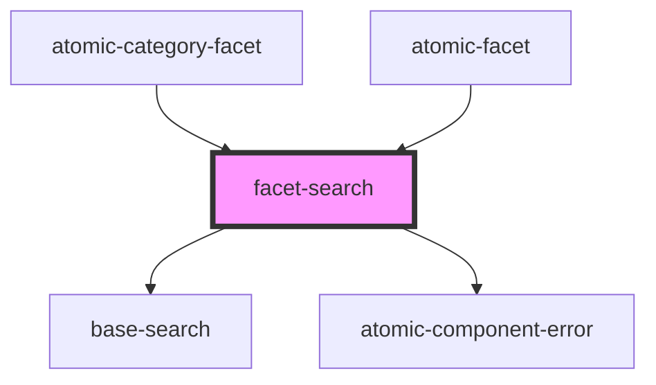

# facet-search

<!-- Auto Generated Below -->

## Properties

| Property                  | Attribute | Description | Type                                                                                                                                                                                                                                                                                                                                                                                                                                                                                                                                                                                                                                                                                                                                                                                                                                                                                                                                                                                                                                                                                                                                                                                                                                                                                                                                                                                                                                                                                                                                                                                                                                                                                                                                                                                                                                                                                                                                                                                                                          | Default                              |
| ------------------------- | --------- | ----------- | ----------------------------------------------------------------------------------------------------------------------------------------------------------------------------------------------------------------------------------------------------------------------------------------------------------------------------------------------------------------------------------------------------------------------------------------------------------------------------------------------------------------------------------------------------------------------------------------------------------------------------------------------------------------------------------------------------------------------------------------------------------------------------------------------------------------------------------------------------------------------------------------------------------------------------------------------------------------------------------------------------------------------------------------------------------------------------------------------------------------------------------------------------------------------------------------------------------------------------------------------------------------------------------------------------------------------------------------------------------------------------------------------------------------------------------------------------------------------------------------------------------------------------------------------------------------------------------------------------------------------------------------------------------------------------------------------------------------------------------------------------------------------------------------------------------------------------------------------------------------------------------------------------------------------------------------------------------------------------------------------------------------------------- | ------------------------------------ |
| `_id`                     | `data-id` |             | `string`                                                                                                                                                                                                                                                                                                                                                                                                                                                                                                                                                                                                                                                                                                                                                                                                                                                                                                                                                                                                                                                                                                                                                                                                                                                                                                                                                                                                                                                                                                                                                                                                                                                                                                                                                                                                                                                                                                                                                                                                                      | `randomID( 'atomic-facet-search-' )` |
| `facet` _(required)_      | --        |             | `Facet \| ({ facetSearch: { select(value: CategoryFacetSearchResult): void; updateText(text: string): void; showMoreResults(): void; search(): void; }; toggleSelect: (selection: CategoryFacetValue) => Promise<PayloadAction<void, string, { arg: { facetId: string; selection: CategoryFacetValue; retrieveCount: number; }; requestId: string; requestStatus: "fulfilled"; }, never> \| PayloadAction<SearchAPIErrorWithStatusCode \| undefined, string, { arg: { facetId: string; selection: CategoryFacetValue; retrieveCount: number; }; requestId: string; rejectedWithValue: boolean; requestStatus: "rejected"; aborted: boolean; condition: boolean; }, SerializedError>> & { abort(reason?: string \| undefined): void; requestId: string; arg: { facetId: string; selection: CategoryFacetValue; retrieveCount: number; }; }; deselectAll: () => Promise<PayloadAction<void, string, { arg: { facetId: string; }; requestId: string; requestStatus: "fulfilled"; }, never> \| PayloadAction<SearchAPIErrorWithStatusCode \| undefined, string, { arg: { facetId: string; }; requestId: string; rejectedWithValue: boolean; requestStatus: "rejected"; aborted: boolean; condition: boolean; }, SerializedError>> & { abort(reason?: string \| undefined): void; requestId: string; arg: { facetId: string; }; }; sortBy(criterion: "alphanumeric" \| "occurrences"): void; isSortedBy(criterion: "alphanumeric" \| "occurrences"): boolean; showMoreValues(): void; showLessValues(): void; state: { facetId: string; parents: CategoryFacetValue[]; values: CategoryFacetValue[]; isLoading: boolean; hasActiveValues: boolean; canShowMoreValues: boolean \| undefined; canShowLessValues: boolean; sortCriteria: "alphanumeric" \| "occurrences"; facetSearch: { values: CategoryFacetSearchResult[]; isLoading: boolean; moreValuesAvailable: boolean; } \| { values: CategoryFacetSearchResult[]; isLoading: boolean; moreValuesAvailable: boolean; }; }; subscribe(listener: () => void): Unsubscribe; })` | `undefined`                          |
| `facetState` _(required)_ | --        |             | `FacetState \| { facetId: string; parents: CategoryFacetValue[]; values: CategoryFacetValue[]; isLoading: boolean; hasActiveValues: boolean; canShowMoreValues: boolean \| undefined; canShowLessValues: boolean; sortCriteria: "alphanumeric" \| "occurrences"; facetSearch: { values: CategoryFacetSearchResult[]; isLoading: boolean; moreValuesAvailable: boolean; } \| { values: CategoryFacetSearchResult[]; isLoading: boolean; moreValuesAvailable: boolean; }; }`                                                                                                                                                                                                                                                                                                                                                                                                                                                                                                                                                                                                                                                                                                                                                                                                                                                                                                                                                                                                                                                                                                                                                                                                                                                                                                                                                                                                                                                                                                                                                    | `undefined`                          |

## Events

| Event         | Description | Type                  |
| ------------- | ----------- | --------------------- |
| `selectValue` |             | `CustomEvent<number>` |

## Dependencies

### Used by

- [atomic-category-facet](../atomic-category-facet)
- [atomic-facet](../atomic-facet)

### Depends on

- [base-search](../../base-search-box)
- [atomic-component-error](../../atomic-component-error)

### Graph

---

_Built with [StencilJS](https://stenciljs.com/)_
