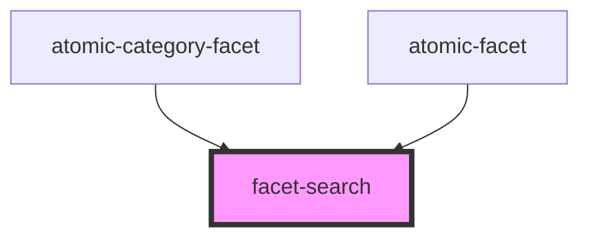

# facet-search

<!-- Auto Generated Below -->

## Properties

| Property                           | Attribute               | Description | Type                      | Default     |
| ---------------------------------- | ----------------------- | ----------- | ------------------------- | ----------- |
| `facetSearchResults` _(required)_  | --                      |             | `BaseFacetSearchResult[]` | `undefined` |
| `moreValuesAvailable` _(required)_ | `more-values-available` |             | `boolean`                 | `undefined` |

## Events

| Event             | Description | Type                                 |
| ----------------- | ----------- | ------------------------------------ |
| `facetSearch`     |             | `CustomEvent<string>`                |
| `resultSelected`  |             | `CustomEvent<BaseFacetSearchResult>` |
| `showMoreResults` |             | `CustomEvent<void>`                  |

## Dependencies

### Used by

 - [atomic-category-facet](../atomic-category-facet)
 - [atomic-facet](../atomic-facet)

### Graph

----------------------------------------------

*Built with [StencilJS](https://stenciljs.com/)*
