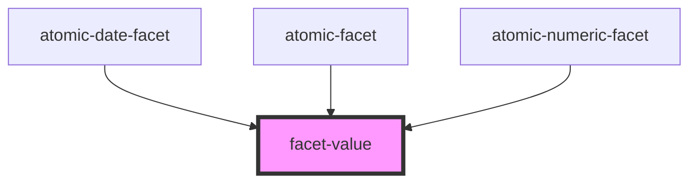

# facet-value

<!-- Auto Generated Below -->

## Properties

| Property                       | Attribute           | Description | Type      | Default     |
| ------------------------------ | ------------------- | ----------- | --------- | ----------- |
| `isSelected` _(required)_      | `is-selected`       |             | `boolean` | `undefined` |
| `label` _(required)_           | `label`             |             | `string`  | `undefined` |
| `numberOfResults` _(required)_ | `number-of-results` |             | `number`  | `undefined` |

## Events

| Event                | Description | Type                |
| -------------------- | ----------- | ------------------- |
| `facetValueSelected` |             | `CustomEvent<void>` |

## Dependencies

### Used by

 - [atomic-date-facet](../atomic-date-facet)
 - [atomic-facet](../atomic-facet)
 - [atomic-numeric-facet](../atomic-numeric-facet)

### Graph

----------------------------------------------

*Built with [StencilJS](https://stenciljs.com/)*
