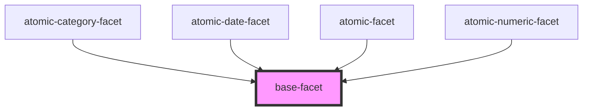

# base-facet

<!-- Auto Generated Below -->

## Properties

| Property                       | Attribute           | Description | Type      | Default     |
| ------------------------------ | ------------------- | ----------- | --------- | ----------- |
| `hasActiveValues` _(required)_ | `has-active-values` |             | `boolean` | `undefined` |
| `label` _(required)_           | `label`             |             | `string`  | `undefined` |

## Events

| Event         | Description | Type                |
| ------------- | ----------- | ------------------- |
| `deselectAll` |             | `CustomEvent<void>` |

## Shadow Parts

| Part      | Description |
| --------- | ----------- |
| `"facet"` |             |

## Dependencies

### Used by

 - [atomic-category-facet](../atomic-category-facet)
 - [atomic-date-facet](../atomic-date-facet)
 - [atomic-facet](../atomic-facet)
 - [atomic-numeric-facet](../atomic-numeric-facet)

### Graph

----------------------------------------------

*Built with [StencilJS](https://stenciljs.com/)*
