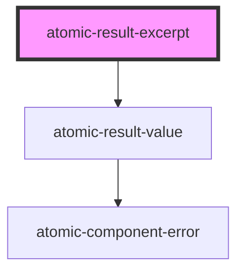

# atomic-result-excerpt

<!-- Auto Generated Below -->

## Shadow Parts

| Part               | Description              |
| ------------------ | ------------------------ |
| `"result-excerpt"` | The result excerpt value |

## Dependencies

### Depends on

- [atomic-result-value](../atomic-result-value)

### Graph

---

_Built with [StencilJS](https://stenciljs.com/)_
