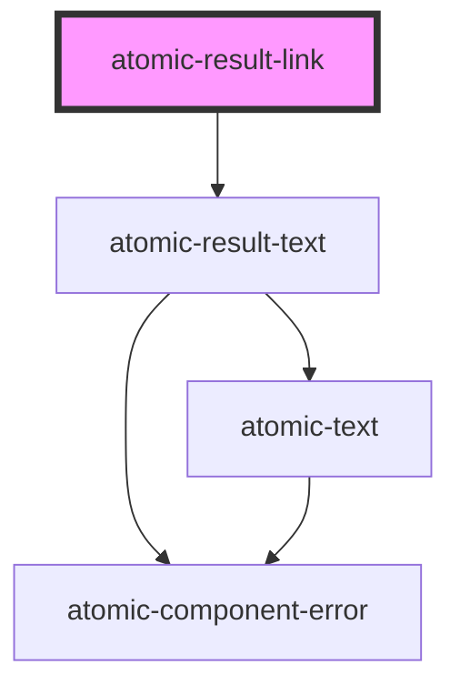

# atomic-result-link

<!-- Auto Generated Below -->

## Properties

| Property | Attribute | Description                                                                                                                                                                                                                                                                                                                                                                                                                                                                                                                                               | Type     | Default   |
| -------- | --------- | --------------------------------------------------------------------------------------------------------------------------------------------------------------------------------------------------------------------------------------------------------------------------------------------------------------------------------------------------------------------------------------------------------------------------------------------------------------------------------------------------------------------------------------------------------- | -------- | --------- |
| `target` | `target`  | Where to display the linked URL, as the name for a browsing context (a tab, window, or <iframe>).  The following keywords have special meanings for where to load the URL: - _self: the current browsing context. (Default) - _blank: usually a new tab, but users can configure browsers to open a new window instead. - _parent: the parent browsing context of the current one. If no parent, behaves as _self. - _top: the topmost browsing context (the "highest" context that’s an ancestor of the current one). If no ancestors, behaves as _self. | `string` | `'_self'` |

## Slots

| Slot        | Description                                          |
| ----------- | ---------------------------------------------------- |
| `"default"` | Allow to display alternative content inside the link |

## Shadow Parts

| Part            | Description     |
| --------------- | --------------- |
| `"result-link"` | The result link |

## Dependencies

### Depends on

- [atomic-result-text](../atomic-result-text)

### Graph

----------------------------------------------

*Built with [StencilJS](https://stenciljs.com/)*
