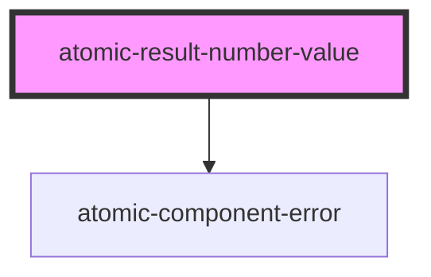

# atomic-result-number-value

<!-- Auto Generated Below -->

## Properties

| Property                   | Attribute                    | Description                                                                                                                                                                                                             | Type                  | Default     |
| -------------------------- | ---------------------------- | ----------------------------------------------------------------------------------------------------------------------------------------------------------------------------------------------------------------------- | --------------------- | ----------- |
| `maximumFractionDigits`    | `maximum-fraction-digits`    | The maximum number of fraction digits to use.                                                                                                                                                                           | `number \| undefined` | `undefined` |
| `maximumSignificantDigits` | `maximum-significant-digits` | The maximum number of significant digits to use.                                                                                                                                                                        | `number \| undefined` | `undefined` |
| `minimumFractionDigits`    | `minimum-fraction-digits`    | The minimum number of fraction digits to use.                                                                                                                                                                           | `number \| undefined` | `undefined` |
| `minimumIntegerDigits`     | `minimum-integer-digits`     | The minimum number of integer digits to use.                                                                                                                                                                            | `number \| undefined` | `undefined` |
| `minimumSignificantDigits` | `minimum-significant-digits` | The minimum number of significant digits to use.                                                                                                                                                                        | `number \| undefined` | `undefined` |
| `property` _(required)_    | `property`                   | The result property which the component should use. Will look in the Result object first and then in the Result.raw object for the fields. It is important to include the necessary fields in the ResultList component. | `string`              | `undefined` |

## Dependencies

### Depends on

- [atomic-component-error](../../atomic-component-error)

### Graph

----------------------------------------------

*Built with [StencilJS](https://stenciljs.com/)*
