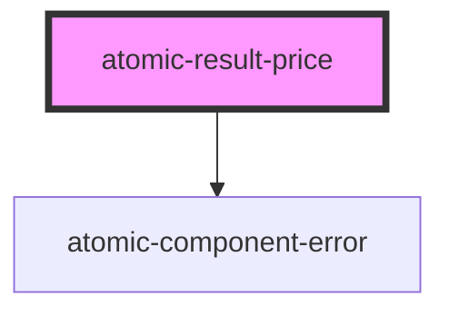

# atomic-result-price

<!-- Auto Generated Below -->

## Properties

| Property   | Attribute  | Description                                                                                                                                                                                                                                                                              | Type     | Default      |
| ---------- | ---------- | ---------------------------------------------------------------------------------------------------------------------------------------------------------------------------------------------------------------------------------------------------------------------------------------- | -------- | ------------ |
| `currency` | `currency` | The currency to use in currency formatting. Possible values are the ISO 4217 currency codes, such as "USD" for the US dollar, "EUR" for the euro, or "CNY" for the Chinese RMB — see the [Current currency & funds code list](http://www.currency-iso.org/en/home/tables/table-a1.html). | `string` | `'USD'`      |
| `field`    | `field`    | The result field which the component should use. This will look in the Result object first, and then in the Result.raw object for the fields. It is important to include the necessary field in the ResultList component.                                                                | `string` | `'ec_price'` |

## Dependencies

### Depends on

- [atomic-component-error](../../atomic-component-error)

### Graph

----------------------------------------------

*Built with [StencilJS](https://stenciljs.com/)*
