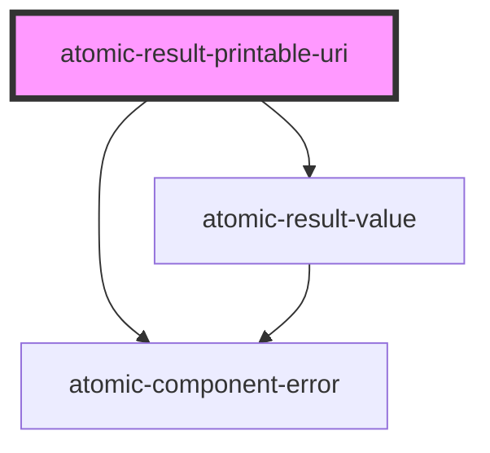

# atomic-result-uri

<!-- Auto Generated Below -->

## Properties

| Property        | Attribute          | Description                                                                                             | Type     | Default |
| --------------- | ------------------ | ------------------------------------------------------------------------------------------------------- | -------- | ------- |
| `maxNumOfParts` | `max-num-of-parts` | The maximum number of Uri parts to display, has to be over the minimum of `3` in order to be effective. | `number` | `5`     |

## Shadow Parts

| Part                                   | Description                            |
| -------------------------------------- | -------------------------------------- |
| `"result-printable-uri-link"`          | A result printable uri clickable link  |
| `"result-printable-uri-list"`          | The result printable uri list          |
| `"result-printable-uri-list-element"`  | A result printable uri list element    |
| `"result-printable-uri-list-ellipsis"` | The clickable ellipsis of a result uri |
| `"result-printable-uri-list-expanded"` | The expanded result printable uri list |

## Dependencies

### Depends on

- [atomic-result-value](../atomic-result-value)
- [atomic-component-error](../../atomic-component-error)

### Graph

----------------------------------------------

*Built with [StencilJS](https://stenciljs.com/)*
